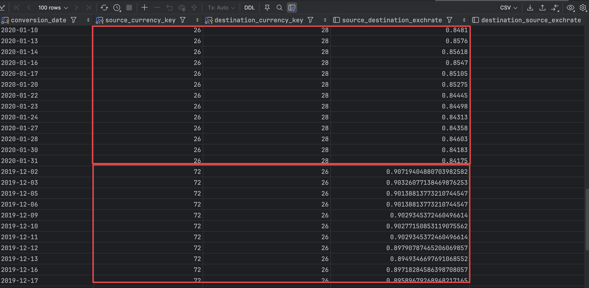
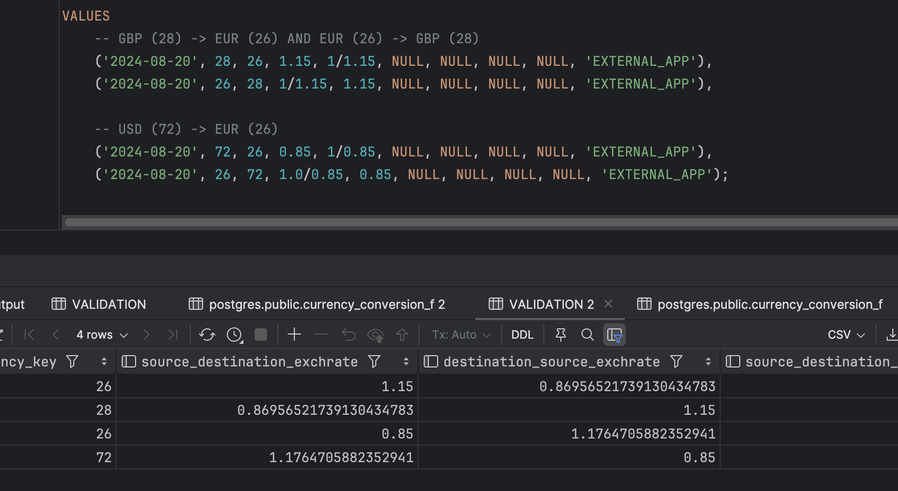
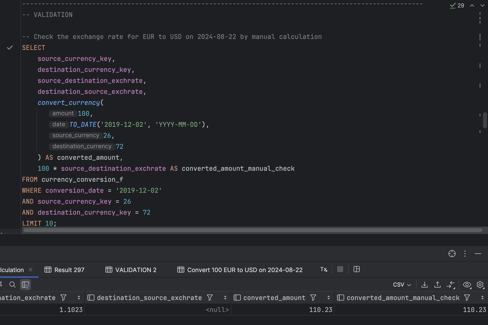
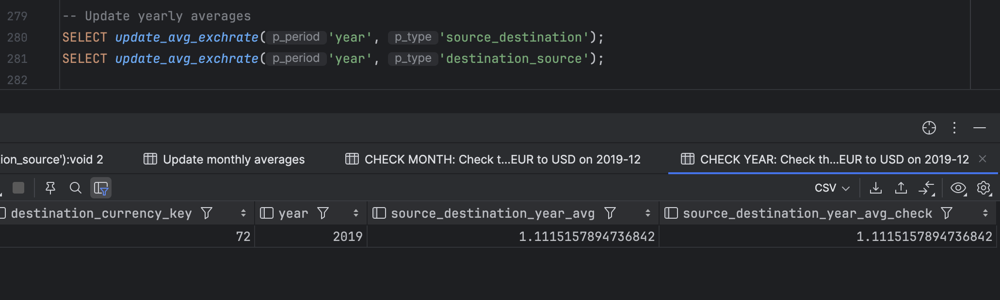
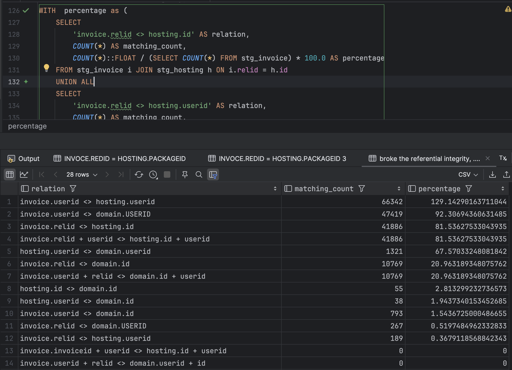
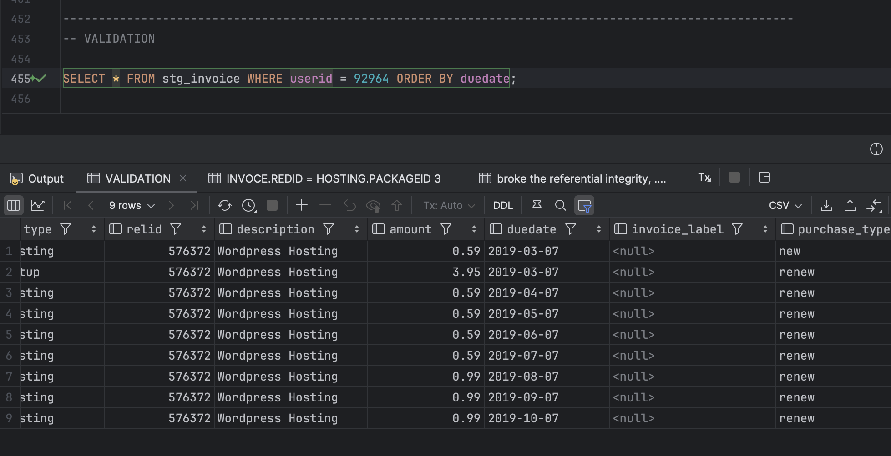
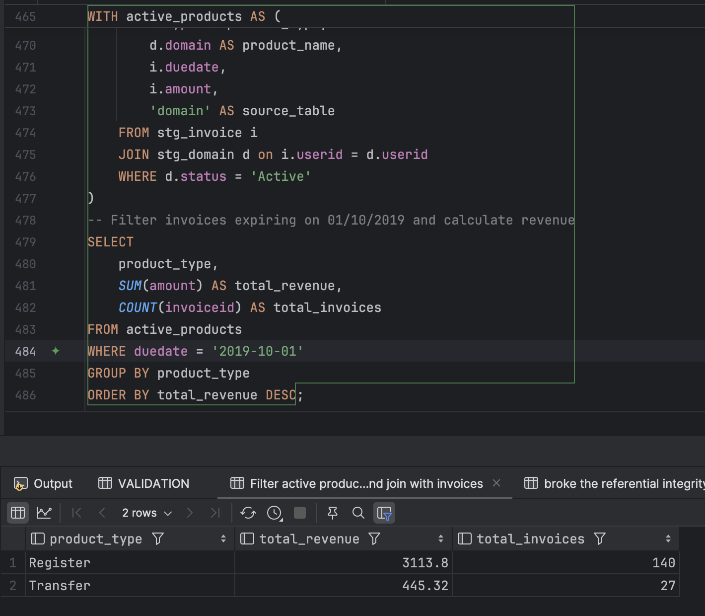

## Requiriments

Docker
psql

## Setup

After clone this repository, you can run the following commands to start the database.

```sh
docker build -t postgresdb .
```

```sh
docker run --name postgresdb -v $(pwd)/data:/data -e POSTGRES_PASSWORD=postgres -p 5432:5432 -d postgres 
```

### Assignment 1

```sh
 PGPASSWORD='postgres' psql -h localhost -p 5432 -U postgres -d postgres -P pager=off -f assignment_1.sql
```

### Assignment 2

```sh
 PGPASSWORD='postgres' psql -h localhost -p 5432 -U postgres -d postgres -P pager=off -f assignment_2.sql
```

## Introduction

After the database is up and running, in the same directory, 
you can run the following commands.

```sql
PGPASSWORD='postgres' psql -h localhost -p 5432 -U postgres -d postgres -f assignment_1.sql
```

Checking table results
```sh
PGPASSWORD='postgres' psql -h localhost -p 5432 -U postgres -d postgres -c "SELECT * FROM currency_conversion_f LIMIT 5;"
```


# Outputs

## Assignment 1

Table creation and relationship

```sql
CREATE TABLE currency_d (
    currency_key INT PRIMARY KEY,
    currency_code CHAR(3) NOT NULL,
    currency_name VARCHAR(200),
    currency_symbol CHAR(4));

CREATE TABLE currency_conversion_f (
    conversion_date DATE NOT NULL,
    source_currency_key INT NOT NULL,
    destination_currency_key INT NOT NULL,
    source_destination_exchrate NUMERIC,
    destination_source_exchrate NUMERIC,
    source_destination_month_avg NUMERIC,
    destination_source_month_avg NUMERIC,
    source_destination_year_avg NUMERIC,
    destination_source_year_avg NUMERIC,
    exchgrates_source VARCHAR(255),
    PRIMARY KEY (conversion_date, source_currency_key, destination_currency_key),
    FOREIGN KEY (source_currency_key) REFERENCES currency_d(currency_key),
    FOREIGN KEY (destination_currency_key) REFERENCES currency_d(currency_key));
```

Ingestion

```sql
COPY currency_d(currency_key, currency_code, currency_name, currency_symbol)
FROM '/data/currency_d.csv' DELIMITER ',' CSV HEADER;

COPY currency_conversion_f(conversion_date, source_currency_key, destination_currency_key,
                           source_destination_exchrate, destination_source_exchrate, source_destination_month_avg,
                           destination_source_month_avg, source_destination_year_avg,
                           destination_source_year_avg, exchgrates_source)
FROM '/data/currency_conversion_f.csv' DELIMITER ',' CSV HEADER;
```

Saving data in all formats present in currency_conversion_F:



Simulating the insertion of data from an external application, 
and exchange rates from pound to €, and from $ to € (GBP->EUR e USD-> EUR)



Given an amount, a date, and the pair (currency 1, currency 2), converts amount from currency 1
to currency 2, using the exchange rate, which is closer in time to date, independently if closer in
the past or in the future.



In presence of DML operations on currency_conversion_F, updates mean monthly and mean yearly values of
exchange rates wherever present.




## Assignment 2

Despite I found some high percentage of matching, I was not able to find a relationship between the tables after
creating PRIMARY KEYS and FOREIGN KEYS. I tried to insert the data into the tables, but all the combinations
broke the referential integrity, ....



Marking new purchases



Calculating the total revenue for active products on 01/10/2019



