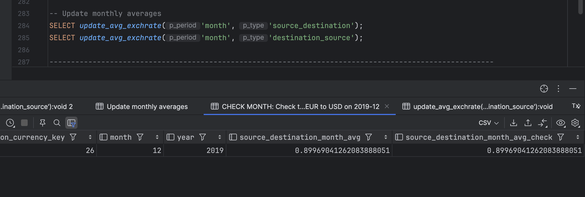

## Requirements

- [Docker](https://www.docker.com/)
- [psql](https://www.postgresql.org/docs/current/app-psql.html)
- [Docker-compose](https://docs.docker.com/compose/install/)

## Setup

After clone this repository, you can run the following commands to start the database.

```sh
docker-compose up db 
```
## Running

The main sql scripts are: [assignment_1.sql](assignment_1.sql) and [assignment_2.sql](assignment_2.sql).
Check them out to see the whole logic. 
But you can also run the following to see some main outputs:  

### Assignment 1

```sh
 PGPASSWORD='postgres' psql -h localhost -p 5432 -U postgres -d postgres -P pager=off -f assignment_1.sql
```

### Assignment 2

```sh
 PGPASSWORD='postgres' psql -h localhost -p 5432 -U postgres -d postgres -P pager=off -f assignment_2.sql
```

# Outputs

Besides that, here is some evidence of it running:

## Assignment 1

Table creation and relationship

```sql
CREATE TABLE currency_d (
    currency_key INT PRIMARY KEY,
    currency_code CHAR(3) NOT NULL,
    currency_name VARCHAR(200),
    currency_symbol CHAR(4));

CREATE TABLE currency_conversion_f (
    conversion_date DATE NOT NULL,
    source_currency_key INT NOT NULL,
    destination_currency_key INT NOT NULL,
    source_destination_exchrate NUMERIC,
    destination_source_exchrate NUMERIC,
    source_destination_month_avg NUMERIC,
    destination_source_month_avg NUMERIC,
    source_destination_year_avg NUMERIC,
    destination_source_year_avg NUMERIC,
    exchgrates_source VARCHAR(255),
    PRIMARY KEY (conversion_date, source_currency_key, destination_currency_key),
    FOREIGN KEY (source_currency_key) REFERENCES currency_d(currency_key),
    FOREIGN KEY (destination_currency_key) REFERENCES currency_d(currency_key));
```

Ingestion

```sql
COPY currency_d(currency_key, currency_code, currency_name, currency_symbol)
FROM '/data/currency_d.csv' DELIMITER ',' CSV HEADER;

COPY currency_conversion_f(conversion_date, source_currency_key, destination_currency_key,
                           source_destination_exchrate, destination_source_exchrate, source_destination_month_avg,
                           destination_source_month_avg, source_destination_year_avg,
                           destination_source_year_avg, exchgrates_source)
FROM '/data/currency_conversion_f.csv' DELIMITER ',' CSV HEADER;
```

Saving data in all formats present in currency_conversion_F:


Simulating the insertion of data from an external application, 
and exchange rates from pound to €, and from $ to € (GBP->EUR e USD-> EUR)


Given an amount, a date, and the pair (currency 1, currency 2), converts amount from currency 1
to currency 2, using the exchange rate, which is closer in time to date, independently if closer in
the past or in the future.


In presence of DML operations on currency_conversion_F, updates mean monthly and mean yearly values of
exchange rates wherever present.




## Assignment 2

Despite I found some high percentage of matching, I was not able to find a relationship between the tables after
creating PRIMARY KEYS and FOREIGN KEYS. I tried to insert the data into the tables, but all the combinations
broke the referential integrity, ....


Marking new purchases


Calculating the total revenue for active products on 01/10/2019


## Bonus

I have alse created an API with two endpoints, one to get the exchange rate for 
a specific date (```GET/exchange_rates```), source currency, and destination currency, 
and another to insert a new exchange rate (```POST/exchange_rates```).


Starting DB
```sh
docker-compose up db --build -d
```

Make sure you have ingested the data:

```sh
PGPASSWORD='postgres' psql -h localhost -p 5432 -U postgres -d postgres -P pager=off -f assignment_1.sql
```

Starting API

```sh
docker-compose up api  --build
```

**⚠️ WARNING: if you are using Apple Silicon, run this instead**:

```sh
DOCKER_DEFAULT_PLATFORM=linux/amd64 docker-compose up api --build
```

Get the exchange rates for a specific date, source currency, and destination currency

```sh
curl -s -X GET "http://127.0.0.1:8000/exchange_rates/?conversion_date=2019-12-05&source_currency_key=26&destination_currency_key=72"
```

Output:


```sh
curl -s -X POST "http://127.0.0.1:8000/exchange_rates/" -H "Content-Type: application/json" -d '{
"conversion_date": "2024-08-21",
"source_currency_key": 26,
"destination_currency_key": 72,
"source_destination_exchrate": 0.85
}'
```

Output:


## Cleaning up

```sh
docker-compose down
```

```sh
docker rmi assignments-exchange-api postgres
```

